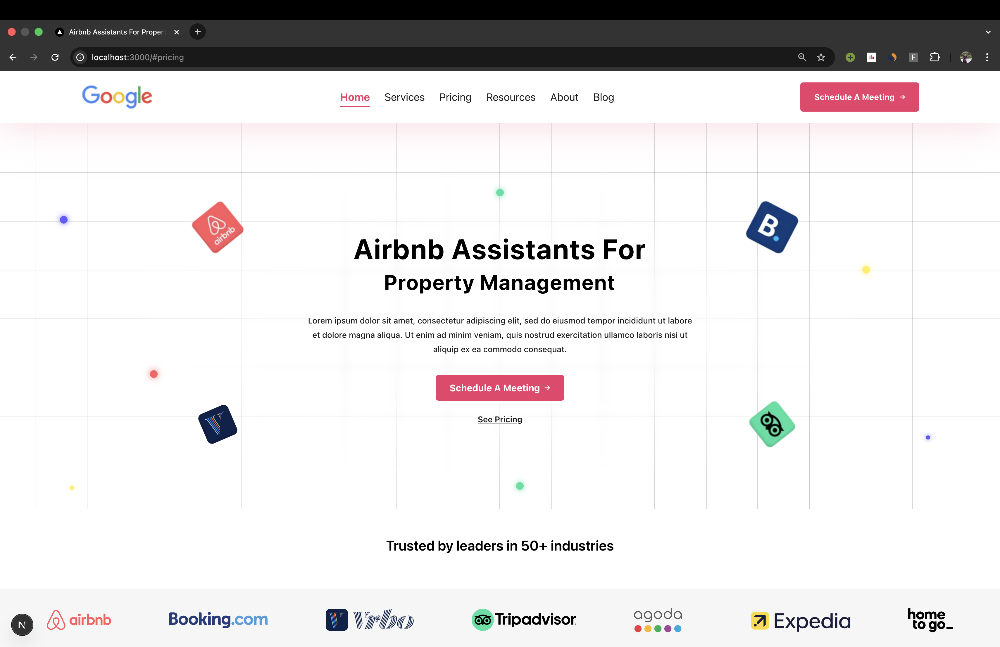
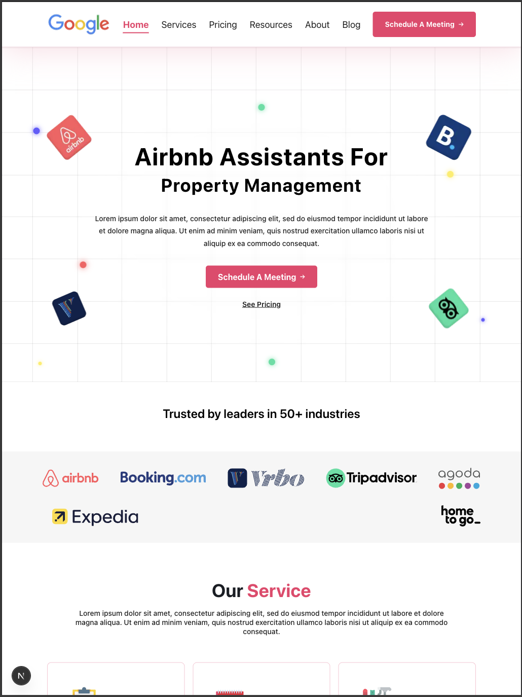
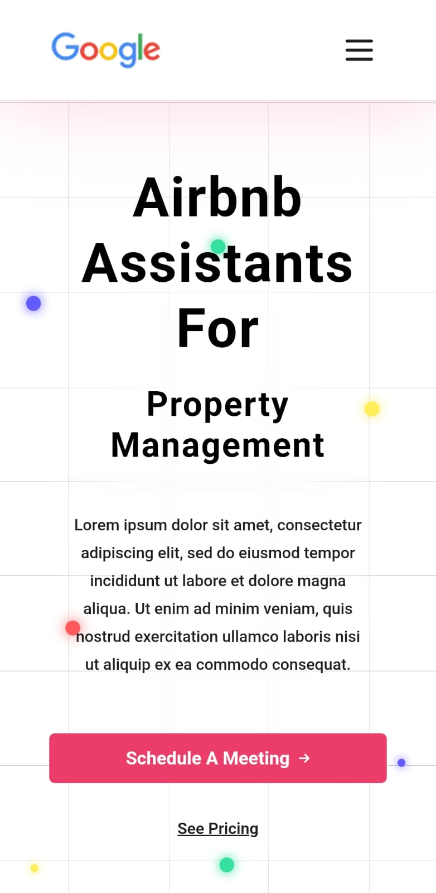

# OneLittleWeb Landing Page Assessment (Next.js)

## Live Demo

- Production URL: `https://onelittleweb-figma-to-nextjs.netlify.app`

## GitHub Repository

- Repository URL: `https://github.com/mdkhaledbin/onelittleweb-figma-to-nextjs.git`

## Overview

This project is a practical interview task for OneLittleWeb (Mid-Level Web Developer role).

The objective was to convert a provided Figma landing page design into a fully working Next.js application with high UI fidelity. The implementation focuses on:

- Accurate layout and spacing
- Responsive behavior across screen sizes
- Consistent styling and section composition
- Clean, modular, and scalable code organization

Design reference:

- Figma: https://www.figma.com/design/UM1FKXjlkAmDh4q11Yu6AM/OLW-Web-Dev-Hiring-Task?m=auto&t=JBsgbtxmxZIGs3EC-1

## Features

- Built with Next.js App Router
- Uses Parallel Routes to render major landing page sections in independent slots
- Section-based loading UIs (`loading.tsx`) prepared for async data integration
- Component-driven architecture with reusable UI building blocks
- Responsive design implementation aligned with the provided Figma
- Animated interactions and transitions for improved UX (Framer Motion)

## Tech Stack

- Framework: Next.js 16 (App Router)
- UI: React 19
- Language: TypeScript
- Styling: Tailwind CSS 4
- Animation: Framer Motion
- Linting: ESLint (Next.js config)
- Deployment: Vercel (or equivalent hosting)

## Architecture & Design Decisions

### Why Next.js

Next.js was selected because it provides:

- A production-ready React framework with routing, performance optimizations, and deployment-friendly defaults
- App Router patterns that encourage clear route and UI composition
- Strong support for scalable front-end architecture as features grow
- Built-in capabilities such as optimized images, font loading, and structured layouts

### Parallel Routing (Core Architectural Decision)

The landing page is organized using App Router parallel slots under `app/`:

- `@hero`
- `@services`
- `@pricing`
- `@tools`
- `@about`
- `@review`

These slots are composed in `app/layout.tsx`, allowing each section to be developed and rendered independently.

Why this matters:

- Performance: independent sections can resolve/render without blocking the entire page tree
- Scalability: each slot behaves like a self-contained route segment, making it easier to evolve into standalone pages later
- Team velocity: isolated section ownership reduces coupling and merge friction
- Maintainability: clear boundaries between concerns improve long-term readability

### Loading UI Strategy

Each major section follows a localized loading UI pattern via `loading.tsx` files (for example in `@hero`, `@services`, `@pricing`, `@tools`, and `@about`).

Benefits:

- Better perceived performance via skeleton states instead of blank areas
- Progressive rendering at section level
- Future-ready for asynchronous data fetching per section
- Improved UX consistency as the app grows

### Modularity and Separation of Concerns

The codebase is intentionally split into reusable, focused modules:

- `components/` for UI building blocks and section components
- `lib/` for constants and shared data structures
- `app/` for route-level composition and slot orchestration

This enables reuse, easier testing, and predictable extension as requirements evolve.

## Folder Structure

```text
.
|-- app/
|   |-- layout.tsx
|   |-- page.tsx
|   |-- @hero/
|   |   |-- page.tsx
|   |   `-- loading.tsx
|   |-- @services/
|   |   |-- page.tsx
|   |   `-- loading.tsx
|   |-- @pricing/
|   |   |-- page.tsx
|   |   `-- loading.tsx
|   |-- @tools/
|   |   |-- page.tsx
|   |   `-- loading.tsx
|   |-- @about/
|   |   |-- page.tsx
|   |   `-- loading.tsx
|   `-- @review/
|       `-- page.tsx
|-- components/
|   |-- common/
|   |-- hero/
|   |-- services/
|   |-- pricing/
|   |-- about/
|   |-- review/
|   |-- navbar/
|   `-- footer/
|-- lib/
|   `-- constants.tsx
|-- public/
`-- README.md
```

## Getting Started

### Prerequisites

- Node.js 20+
- npm (or yarn/pnpm/bun)

### Installation

```bash
git clone <repository-url>
cd onelittlelab_assessment
npm install
```

### Run Locally

```bash
npm run dev
```

Open `http://localhost:3000` in your browser.

### Production Build

```bash
npm run build
npm run start
```

## Deployment

This project is deployed and can be hosted on platforms such as Vercel.

- Vercel Project URL: `<add-vercel-url>`
- Alternative hosting: Netlify, Render, or any Node.js-compatible platform

## Screenshots

- Desktop view: 
- Tablet view: 
- Mobile view: 

## Future Improvements

- Replace placeholder/static copy with CMS or API-driven content
- Add automated tests (unit + integration + visual regression)
- Add analytics and performance monitoring (Core Web Vitals)
- Improve accessibility audit coverage (ARIA, keyboard navigation, contrast)
- Extend slot segments into dedicated pages (for example, detailed services/pricing pages)

## OneLittleWeb Hiring Process Note

This repository was developed as part of the OneLittleWeb hiring process for the Mid-Level Web Developer role. The task emphasized practical Next.js execution, UI precision, responsiveness, and clean engineering structure.

## License

This project is licensed under the MIT License.

See the [LICENSE](LICENSE) file for details.
